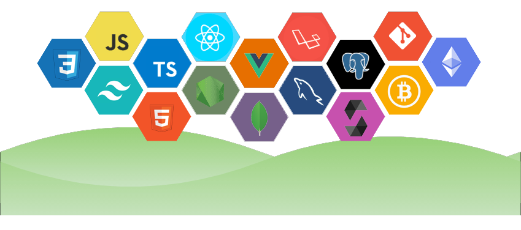

## Welcome to my Github profile page!
👋 Hi there! I'm Kevin Lin, a senior fullstack developer. I love programming and I have been lucky since my hobby and my job merged together.🥳🥳🥳

## 📖 About Me
I have been in this industry for 9️⃣+ years since when I started working on the first world-facing web in a Chinese infor-tech company just after my graduation.

I loved computers and technology from a young age which was just something that interested me and I always had fun with it. I majored in the robotics engineering 🤖 in [Ton Duc Thang University](https://en.wikipedia.org/wiki/T%C3%B4n_%C4%90%E1%BB%A9c_Th%E1%BA%AFng_University) and after the graduation followed by some engineering career, took the major course in computer science from the [State University of New York at Fredonia](https://www.fredonia.edu/)

After the graduation, I have worked in several companies across the world 🌎. Most of times, I worked as a freelance web developer, designer, or project manager for a variety of businesses both big and small.
I built so many beautiful websites using modern technologies like Laravel, React, Vue and Node. I loved my job as long as I could create something people enjoy on the internet.

In 2017, I happened to learn about blockchain technology 🤩 and since then I was totally absorbed in the crypto. I am passionate about everything in the crypto: Bitcoin, Ethereum, Solana, Algorand, Solidity, Rust, Pyteal and whatever... I coded any code I saw, demoed anything I learned and read any docs I bumped into.

Today, after years of working with a wide variety of technologies and interfacing with clients in different settings 🏃‍♂️, I can help to give shape and form to clients' dreams and ideas. I am global aware can help you and your business tune into the global marketplace. At the same time, I have a long history and a Human-to-Human philosophy of working with clients.

## 📚 My Tech Skills

## ✨ My Hobbies

📖 Reading books 
⚽ Playing soccer 
🵠Listening music 
💪 Fitness 

## 💖 Interests
- UFO
- UEFA
- Photography
- Cinematography
- Food
- Interior Design

## 💬 Favorite Quote
<i>“History is an unending dialogue between the present and the past”</i> - a statement by [Edward Hallet Carr](https://en.wikipedia.org/wiki/E._H._Carr)

## 😂 Favorite Meme

## 🤝 How To Reach Me
You can reach out to me via email [philip_acho@outlook.com](mailto:philip_acho@outlook.com). Or here are my social accounts!

